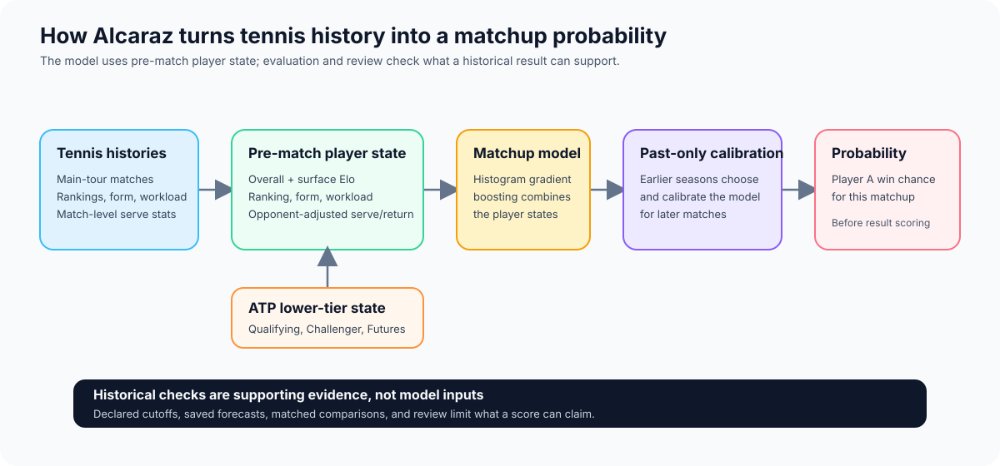
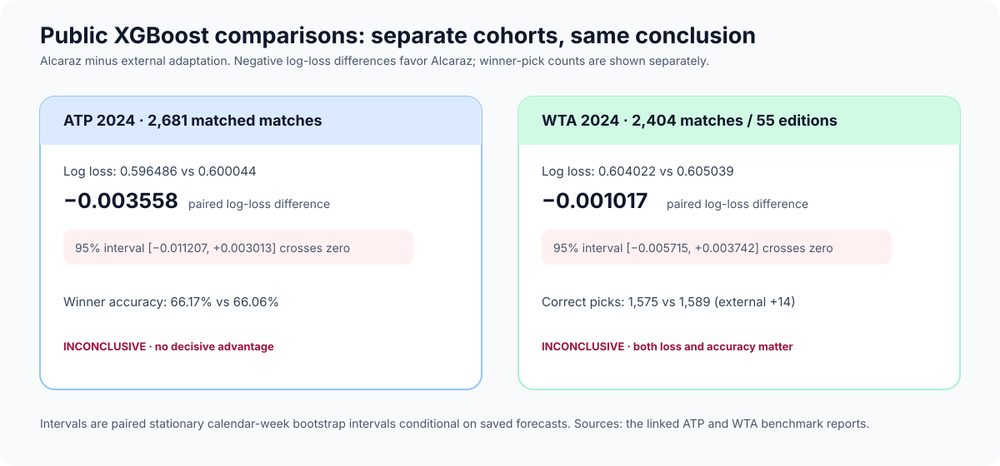

# Alcaraz

**Evidence-first research on calibrated tennis probabilities.** Alcaraz predicts
men's (ATP) and women's (WTA) matches with histogram gradient boosting, then
tries to disprove its own apparent improvements. It combines opponent-adjusted
Elo, rankings, surface, workload, player traits, and dynamic serve/return
strength. The men's route can also use qualifying, Challenger, and Futures
history.

The project is deliberately more than a score table. Its useful output is a
reproducible record of what was compared, what survived a paired check, what
failed to generalize, and why no historical result becomes a live or betting
claim. The released models are retrospective research artifacts—not a proven
edge or a demonstrated pre-play forecasting service.

## What the repository has established

- On its specified historical cohorts, the accepted model has lower log loss
  than all five implemented ranking/Elo baselines: **18,972 ATP matches
  (2017–2024)** and **12,900 WTA matches (2019–2024)**. Those are complete
  systems with different information histories; this is not a universal
  "best model" claim.
- The more demanding public-XGBoost comparisons are **inconclusive on both
  tours**. On ATP 2024, Alcaraz's log-loss point estimate was lower; on WTA
  2024 it had a slightly lower loss point estimate while the comparator made
  **14 more correct picks**. Every primary paired interval crossed zero.
- Recent additions—serve-component representations, richer state geometry,
  model stacks, and WTA downstream selection—produced negative, inconclusive,
  or narrowly conditional results. The incumbent remains the default.
- No batch of real forecasts has been verified as issued before play and later
  scored under a predeclared plan.

## The research system

The men's pipeline uses **51,222 main-tour matches from 2005–2024**,
**480,012 eligible lower-tier results**, and **24.2 million service points
aggregated from match-level serve statistics**. The separate women's history
covers **2007–2026**, including a partial 2026 season. These are source-record
and aggregate-point counts, not 24.2 million independent point sequences.

The diagram is the contract: raw inputs do not go straight to a leaderboard.
They are qualified, ordered at a declared information cutoff, transformed into
state and features, and written as forecasts before outcomes are permitted into
the report. Reviewers can reconstruct the headline arithmetic without trusting
the production scorer.

## Results, read at their proper grain

**Log loss** rewards calibrated probabilities and penalizes confident mistakes;
lower is better. **Accuracy** is the share of correct winner picks. Each row
below compares systems on an identical, named cohort. The rows are not one
combined performance line: they use different populations, histories, and
estimands.

| Comparison | Cohort | Probability-score result | Winner-pick result | Reading |
|---|---:|---|---|---|
| [Five ranking/Elo baselines](docs/benchmarks/G_L_RESULTS.md) | ATP 18,972; WTA 12,900 | Alcaraz lower log loss than all five on each tour | Reported separately by tour | A bounded, independently reconstructed historical benchmark |
| [buildoak XGBoost adaptation — ATP](docs/benchmarks/BUILDOAK_2024_RESULTS.md) | 2,681 ATP, 2024 | 0.596486 vs 0.600044 | 66.17% vs 66.06% | Alcaraz point lead; log-loss interval crosses zero |
| [buildoak XGBoost adaptation — WTA](docs/benchmarks/BUILDOAK_WTA_2024_RESULTS.md) | 2,404 WTA / 55 editions, 2024 | 0.604022 vs 0.605039 | 1,575 vs 1,589 correct | Inconclusive; external system has 14 more correct picks |

The external adaptations retain their own forecasting methods and different
source histories. They are neither reproductions of the source author's
headline results nor identical-input algorithm contests. Both are exposed
historical development work with conditional fixed-forecast uncertainty.

## What changed the project

The early work produced plausible backtests. Adversarial review showed that
plausible did not mean trustworthy: draw-page rounds had been converted into
invented match dates and labelled “reported,” a learned constant could see the
future, and a calibration stage scored before its barrier. The repair was
structural rather than rhetorical: typed time bases, fold-specific eligibility,
forecast/report barriers, frozen bindings, planted leak controls, and
independent reconstruction.

That discipline also changed how negative results are handled. A failed model
is not quietly replaced by a newer chart; it stays in the record with its
population and uncertainty.

| Tested idea | Exact retrospective result | What it changed |
|---|---|---|
| [Eight-member stack and alternatives](docs/CAMPAIGN_E_RESULTS.md) | ATP stack delta −0.000419 log loss, 95% interval crosses zero; WTA point estimate worse | No default replacement |
| [Serve-component representation](docs/experiments/RECENT_EXPERIMENTS.md#serve-components) | 7,610 ATP 2021–2023 targets; primary delta −0.000076780, interval crosses zero | No component promotion |
| [WTA downstream selection](docs/experiments/RECENT_EXPERIMENTS.md#wta-selection) | 7,140 targets; delta −0.000082, interval crosses zero; one net correct pick | Defer the tested policy |
| [Richer state geometry](docs/experiments/RECENT_EXPERIMENTS.md#richer-state-geometry) | 7,610 targets; log loss worsened by 0.000146803, interval includes zero | No state-feature promotion |

The result is intentionally less dramatic than a continuous upward curve. It is
a more useful research history: improvements must survive matched probability
scores, winner-pick accounting, and an uncertainty check before they can alter
the default.

## Reproduce, inspect, or reuse carefully

[**Download accepted models**](https://github.com/riddlejack/alcaraz/releases/tag/models-2026-09-14)
· [Experimental model bundle](https://github.com/riddlejack/alcaraz/releases/tag/campaign-e-research-models-2026-09-15)
· [Inference guide](docs/MODEL_RELEASE.md)
· [Methods](docs/METHODS.md)
· [System design and development](docs/PROCESS.md)
· [Data scale and table provenance](docs/benchmarks/LANDING_PAGE_FACTS.json)

The accepted download includes 40 trained checkpoints and calibration parameters;
the experimental bundle preserves 140 fitted estimators and combination
decisions. Private source rows are excluded. Player-level forecasting requires
the [qualified history workflow](docs/live/README.md), and the repository does
not represent that unfinished workflow as an available live service.

Code: **MIT**. Match, ranking, and player data: **Jeff Sackmann / Tennis
Abstract**, with source terms and additional attribution in
[DATA_LICENSES.md](DATA_LICENSES.md). The public XGBoost comparison is an
adaptation of [buildoak/tennis-xgboost-autoresearch](https://github.com/buildoak/tennis-xgboost-autoresearch/tree/237d1e7ae020de062a994dd7f987881fa2c9a795);
its code and research story remain separately attributed.
