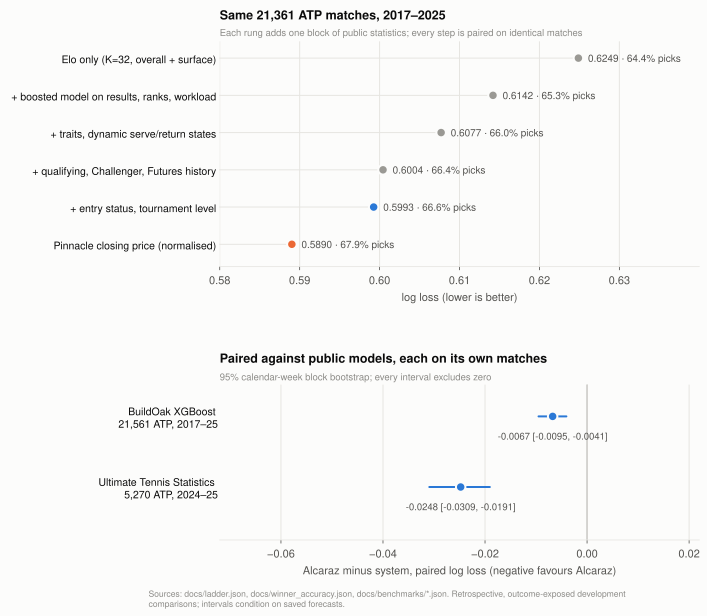
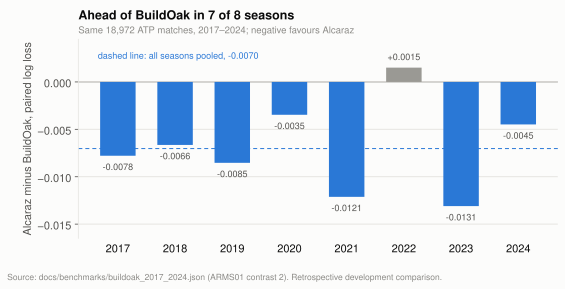
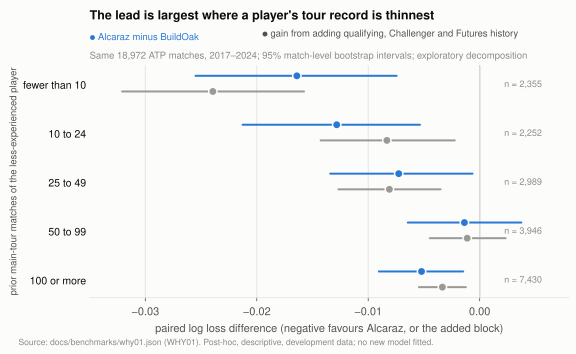

# Alcaraz

**SOTA public statistics-only tennis prediction model. Only 0.010 log loss behind the betting market.**

Alcaraz predicts professional tennis matches from the public record alone: results,
rankings, serve and return statistics, lower-tier history and the published draw. No
betting price, injury report or scouting note enters the model. On 21,561 ATP matches
from 2017 to 2025 it scores ahead of the strongest public model that could be reproduced,
and every men's-tour comparison that could be built has a 95% interval that excludes zero.
Within that scope it is the state of the art as far as it could be tested; the one model
that could not be run is named below, not assumed beaten.

The sharpest benchmark is the market itself. Against Pinnacle's closing price on the same
matches, Alcaraz trails by 0.010 log loss, about one correct pick in seventy-six. The leading
hypothesis is that most of that gap is information the public record does not hold:
fitness, injuries, withdrawals and how much a match matters to each player on the day.

The project started with Green Code's *I Trained AI to Predict Sports*. Its first model
reported 85% accuracy and, as its creator later disclosed, had post-match ratings leaking
into pre-match features. That left a question worth answering properly: with every leak
hunted down, how well can public statistics really predict tennis?



## Results

Log loss scores a probability forecast, and lower is better: a coin flip scores 0.693.
Every comparison below is paired, meaning both systems are scored on exactly the same
matches, with a 95% interval from a calendar-week block bootstrap. Every number is
generated from a committed artifact, and every accepted result was reproduced from
separate code before acceptance. The record runs from 2017 to 2025. The 2025 season was
scored after the model was frozen, but it had been inspected before the freeze, so it
extends the record rather than testing it blind; each linked page keeps the registered
2017–2024 result beside the extended one. Full tables and per-season values:
[RESULTS.md](docs/RESULTS.md) and [docs/benchmarks](docs/benchmarks).

### Each block of public statistics moved the model closer to the market

The same 21,361 ATP matches from 2017 to 2025, every one with a Pinnacle price. Each row
adds one block of inputs to the row above, and every step's interval excludes zero.

| Model | Log loss | Correct picks |
|---|---:|---:|
| Elo ratings only, no fitting | 0.6249 | 64.4% |
| + boosted model on results, rankings and workload | 0.6142 | 65.3% |
| + player traits and dynamic serve/return states | 0.6077 | 66.0% |
| + qualifying, Challenger and Futures history | 0.6004 | 66.4% |
| **+ entry status and tournament level: Alcaraz** | **0.5993** | **66.6%** |
| Pinnacle closing price, normalised | 0.5890 | 67.9% |

Alcaraz minus Pinnacle: +0.0102 [+0.0082, +0.0123], behind the market in each of the nine
seasons. The model is refitted for each season on the five seasons before it and
calibrated on the three seasons immediately before it, so no season is scored by a model
that has seen it. On 2025 alone the frozen model scores 0.6136 against 0.6025 for
Pinnacle on 2,479 priced matches, a gap of +0.0111 [+0.0048, +0.0174] that sits inside the
range of the eight seasons before it; the registered 2017–2024 gap was +0.0101
[+0.0080, +0.0122] ([details](docs/benchmarks/REFIT2025_RESULTS.md)).

### Head to head with public models

Each row is its own matched comparison, so the public model and Alcaraz share every match
in that row, and Alcaraz is the same frozen model in every row. Its own score shifts
slightly between rows because the match sets differ: the 21,561-match set includes 200
matches without a market price, and the Elo row weights each season equally.

| Public model | Matches | Their log loss | Alcaraz | Alcaraz minus theirs [95% interval] | Seasons ahead |
|---|---|---:|---:|---:|---:|
| [BuildOak XGBoost](https://github.com/buildoak/tennis-xgboost-autoresearch), replayed season by season | 21,561 ATP, 2017–25 | 0.6058 | 0.5991 | −0.0067 [−0.0095, −0.0041] | 8 of 9 |
| [Ultimate Tennis Statistics](https://github.com/mcekovic/tennis-crystal-ball) formula | 5,270 ATP, 2024–25 | 0.6276 | 0.6028 | −0.0248 [−0.0309, −0.0191] | 2 of 2 |
| Ingram's Bayesian point model | 5,270 ATP, 2024–25 | 0.6471 | 0.6028 | −0.0443 [−0.0519, −0.0367] | 2 of 2 |
| IBM Match Insights, every provably pre-match forecast recoverable | 64 Grand Slam matches, 2022–23, both tours | 0.6012 | 0.5154 | −0.0858 [−0.1468, −0.0188] | — |
| Five Elo and ranking baselines (FiveThirtyEight, Kovalchik, WElo, pooled Elo, ranking logistic) | 21,561 ATP; 15,251 WTA | 0.6229 to 0.6334 (ATP) | 0.5987 (ATP) | every interval excludes zero, on both tours | every season, both tours |

BuildOak is the closest, and the interval says the lead is real, not one lucky season:



The registered eight-season result was −0.0070 [−0.0100, −0.0040], ahead in 7 of 8. In
2025 BuildOak's own recipe switched on its recent-seasons model on the men's tour for the
first time, and Alcaraz still led that season by 0.0047
([details](docs/benchmarks/BUILDOAK_2017_2025_RESULTS.md)).

The women's tour runs through the same pipeline with its own history and is never pooled
with the men's result. The registered test ran on 12,900 WTA matches from 2019 to 2024,
where the entry-status block passed again (−0.0012 against the previous version
[−0.0020, −0.0005], 6 of 6 seasons). The BuildOak comparison is inconclusive: −0.0019
[−0.0050, +0.0009] on 15,251 matches from 2019 to 2025, ahead in 4 of 7 seasons, with
BuildOak ahead in 2025 (registered on 2019–2024: −0.0026 [−0.0058, +0.0004], a test with
16% power at the margin seen in 2024). A logit blend of the two systems, weighted on the
three preceding seasons only, scores 0.0027 below Alcaraz alone [−0.0039, −0.0014] on
9,532 WTA matches from 2022 to 2025; it is published as a research result, not the
default model. Against the market, the women's model trails Pinnacle by 0.0194
[+0.0165, +0.0223] on 15,028 priced matches from 2019 to 2025 (0.6106 against 0.5913)
([details](docs/benchmarks/BUILDOAK_2017_2025_RESULTS.md)).

The IBM row is the smallest sample and needs the most care. IBM's Grand Slam "Likelihood to
Win" is not kept fixed: every 2024 and 2025 file on wimbledon.com was re-published after the
tournament, and 2023 files were rewritten on match day, so only copies provably published
before the first ball count: 29 saved by the Internet Archive and 36 recovered from the
2023 files, with first-ball times taken from the archived order of play
([details](docs/benchmarks/IBM02_RESULTS.md)). On those 64, Pinnacle scores
0.4876. The gap is sharpness, not picks: IBM's favourite averages 61% and never
exceeds 85%, so it picks nearly as well while its probabilities score far worse. The
archived 29 carry the gap; the 36 evidenced 2023 files alone are inconclusive, and the
two groups differ in site, year and round.

Green Code's second model could not be run, but its Wimbledon 2025 men's draw can be
scored: he reports 66.3% correct picks, with bookmakers at 72%. The frozen model, issued
two days before each match, picked 71.7% of winners on all 127 main-draw matches
[63.8, 79.5], and Pinnacle 70.8% on the 120 with a price; an interval that wide makes it a
same-tournament reading, not a ranking ([details](docs/benchmarks/REFIT2025_RESULTS.md)).

## What is in the model

Alcaraz is a histogram gradient-boosting classifier over 57 inputs, refitted each season
on a five-year window and calibrated on the three seasons before the target. The inputs
come in five blocks, and the table above adds them one at a time:

- **Ratings.** Overall and surface Elo from tour results.
- **Match history.** Rankings, recent workload and rest, match format, player traits.
- **Serve and return states.** A dynamic model of each player's serve and return
  strength, updated match by match and adjusted for who they played. This is the block
  that separates a strong run from an easy draw.
- **Lower-tier history (ATP).** Qualifying, Challenger and Futures results and serve
  statistics. It is the largest single gain in the table above because it fills in the years
  before a player reaches the main tour.
- **Draw context.** Each player's entry status (qualifier, lucky loser, wild card,
  protected ranking) and the tournament level, both published with the draw. Round and
  seeding are not used.

The fifth block came out of review. A screen in the independent review of 22 September
found that the model underrated qualifiers: in matches with exactly one qualifier,
qualifiers won 39.5% and the model gave them 34.6%. Entry status had never been an input,
and the qualifying wins behind it are not yet visible at the two-day cutoff. A registered
experiment then added the block and refitted all eight seasons: −0.0011 against the
previous version [−0.0018, −0.0004], 6 of 8 seasons negative. With 2025 added, it gains
0.0012 [0.0006, 0.0017] on the priced matches of the table above, in 7 of 9 seasons.

No price, odds or market field enters the model. Every result, rating and statistic must
be knowable two days before the match date; draw facts such as surface, format, entry
status and level come with the pairing itself. The pipeline records which outcomes each
fold read and refuses anything later.

## Where the lead over public models comes from

The rival forecasts are on disk, so the lead can be taken apart match by match. An
exploratory decomposition of the saved forecasts (post hoc, on development data, no new
model; [details](docs/benchmarks/WHY01_LEAD_DECOMPOSITION.md)) gives four findings.

**The lead is concentrated where a player's main-tour record is thin.** Against BuildOak,
matches with a qualifier, lucky loser or wild card are 35% of the sample and carry 58% of
the gap (−0.0112 [−0.0156, −0.0068]); matches whose lower-ranked player sits at 101–200
carry 44%; matches where a player has fewer than 10 prior main-tour matches carry 28% on
12% of the sample (−0.0151 [−0.0236, −0.0070]). These overlap, because they describe the
same match: a qualifier from outside the top 100 with little tour record. Alcaraz still
leads in the remaining 56% of matches (−0.0037 [−0.0065, −0.0009]) and is level with
BuildOak from the quarter-finals on. The same pattern holds against the Elo baselines and,
on 2024, against Ultimate Tennis Statistics and Ingram; the ranking-only baseline is the
exception, because a ranking already reflects lower-tier results.



**That is the lower-tier history block at work.** On the same matches, the model one step
below it (ratings, match history, serve and return states) is level with BuildOak
(+0.0015 [−0.0005, +0.0036]) and behind it when a player has fewer than 10 tour matches
(+0.0081 [+0.0011, +0.0153]). Adding qualifying, Challenger and Futures history gains
−0.0220 [−0.0301, −0.0144] in those matches and nothing from the quarter-finals on. BuildOak
reads main-tour files only and drops entry status, so neither block has a counterpart
there. The entry-status block's smaller gain sits where expected: matches with a qualifier,
lucky loser or wild card (−0.0027 [−0.0040, −0.0014]) and Grand Slams (−0.0024
[−0.0033, −0.0015]).

**The lead is better ranking of matches, not better calibration, except against Ingram.**
If each rival were perfectly recalibrated on the very outcomes it is scored on, an upper
bound rather than a legitimate forecast, BuildOak's gap would shrink by 17%, and on 2024
Ultimate Tennis Statistics' by 19% and Ingram's by 48%. What remains is discrimination: Alcaraz's
AUC is higher by 0.008 against BuildOak and by about 0.03 against the other two. BuildOak
is overconfident (recalibration slope 0.88), consistent with a recipe its author selected
on ROC AUC, which rewards ordering and ignores calibration; Ingram's point model is
strongly overconfident (slope 0.62); the Elo baselines are well scaled but over-rate the
older player, as ratings that lag rising players would. Alcaraz's own slope is 0.99. The
past-only calibration stage does its job.

**When the systems disagree, Alcaraz is right slightly more often and pays less when
wrong.** Alcaraz and BuildOak pick different winners in 2,496 matches, 11.6% of the
sample; Alcaraz is right in 1,309, BuildOak in 1,187, and those matches carry a third of
the gap. Where the two probabilities differ by 0.15 or more, BuildOak is the more
confident side and loses more when wrong, and such disagreements are twice as common in
thin-history matches. The market is the mirror image: Pinnacle's edge over
Alcaraz is also discrimination, and it concentrates after a long absence from the tour,
in first and second rounds and at Grand Slams, which is where the next section starts.

## Where the remaining gap to the market comes from

Adding any weight of Alcaraz to Pinnacle's price makes the price worse, so the market
already holds everything the model knows. Using the price as a training signal, never as
an input, recovered −0.0007, below the registered gate. An exploratory screen of the gap, not
a registered result, found it concentrated where private information is richest: matches
involving a qualifier, Grand Slams, and players returning from a long absence. Before the
final experiments the estimate was that public statistics could close 0.002 to 0.003 of
the 0.011 gap; the entry-status block took 0.0011 of that, and a registered tuning pass over
110 candidate models found nothing more. The rest is acquisition, not modelling.

For scale, Green Code's Wimbledon 2025 test put the bookmakers' picks at 72% against his
model's 66.3%, by his account. Alcaraz's gap to Pinnacle over nine seasons is 1.3 points
of accuracy and 0.010 of log loss. Different matches, but the same benchmark.

## Registered before scored, reproduced before accepted

Every accepted result was registered before it was scored: the matches, the cutoff, the
inputs, the primary contrast and the pass rule were frozen and hashed first, then scored
once. A second implementation, written separately, reproduced every estimate and interval
before acceptance. Leak detectors enter CI only after failing a planted leak. The
145-entry leaderboard and the 133-entry experiment ledger are published in
`data/registries`, so every attempt, including the failures, is visible. Nothing on disk
is an untouched test set: the 2025–26 seasons were opened before the model was frozen, so
they are development data and the 2025 results above extend the record, not test it.

The discipline came out of review. The first version of this project produced plausible
backtests, and independent review found four ways they were wrong:

| What review found | What it would have done | What changed |
|---|---|---|
| Draw-page round order was being turned into match dates | A 2026 Canada final leaked into two later Cincinnati rows | Every date now carries a typed basis: anchor, bound or clock |
| A learned constant was fitted through 2016 and used inside 2014–16 folds | Selection data influenced a "past-only" parameter | Every learned constant carries a horizon receipt |
| A calibration stage wrote scores before the report barrier | Downstream barriers could not stop an upstream scorer | Forecasts are emitted before the barrier, scores after |
| A 24-test leakage suite stayed green when leaks were planted | "All green" meant nothing | A detector enters CI only after it fails its planted control |

[PROCESS.md](docs/PROCESS.md) records each failure and the rule it produced.

## Experiments that did not improve the model

Each was a registered comparison on matched matches. A null here is a result, not an
abandoned idea.

| Tried | Result | Outcome |
|---|---|---|
| Larger boosting head, longer training window | +0.0033 log loss, interval wholly adverse | keep the small model |
| Eight-member stack over the incumbent and alternatives | −0.0004, interval crosses zero | not adopted |
| Uncertainty-aware serve/return states through the final model | +0.0002 | not adopted |
| Serve sub-components, richer state geometry, WTA selection policy | all within ±0.0002 | not adopted |
| Market-as-teacher distillation | −0.0007 against outcome-only | below the 0.003 gate |
| Model + Pinnacle residual | worse than calibrated Pinnacle alone | market already contains the model |
| Past-only logit blend with BuildOak, ATP 2020–24 | −0.0009 [−0.0021, +0.0003] against Alcaraz alone; with 2025 added, −0.0011 with an interval that touches zero | no ATP blend released |
| One registered tuning pass over the boosted head: 110 candidates with early stopping, tree size, minimum leaf, L2 and bagging | −0.0000 [−0.0004, +0.0003] on 18,972 ATP matches | model frozen |
| Weather, fatigue, point-by-point states | worse or null | retired |

## Run it

```sh
make setup
make reproduce-small
```

That reproduces the full pipeline on a synthetic sample in about a minute, and CI does
the same on every push. The codebase is 53k lines of Python in one pipeline, with 785
tests and a locked environment. Real match history is governed by source terms and stays
out of Git; the accepted model checkpoints are a
[GitHub release](https://github.com/riddlejack/Alcaraz/releases/tag/models-2026-09-14)
with an [inference guide](docs/MODEL_RELEASE.md).

## Scope and limits

- Retrospective research. Two real forecasts have been issued before their scheduled
  start under a [hash-chained ledger](docs/live/README.md); no scored prospective record
  exists yet.
- The model is frozen. The registered tuning pass could have detected a gain of about
  0.0005 and found none, so no further feature or learner search runs on these matches.
  One registration–implementation deviation in the entry-status experiment was caught by
  checking the code against the registration and rerun exactly as registered; both
  attempts are reported
  ([details](docs/benchmarks/BUILDOAK_2017_2024_RESULTS.md)).
- Pinnacle's quote time is unknown, so the market comparison is descriptive.
- The head-to-head rows compare complete systems with different legitimate histories,
  not one algorithm against another on identical inputs. BuildOak's recipe was selected
  by its author with sight of later data; the eight-season design was frozen before its
  scores existed but was not blind to the 2024 result, and the 2025 season reran the same
  frozen adaptation.
- The women's public-model comparison is inconclusive at its sample size.

Methods: [METHODS.md](docs/METHODS.md) · Data and licences:
[DATA.md](docs/DATA.md), [DATA_LICENSES.md](DATA_LICENSES.md) · Decisions:
[DECISIONS.md](docs/DECISIONS.md)

Code is MIT. Match, ranking and player data are from Jeff Sackmann / Tennis Abstract
under CC BY-NC-SA 4.0. The XGBoost comparison adapts
[buildoak/tennis-xgboost-autoresearch](https://github.com/buildoak/tennis-xgboost-autoresearch).
