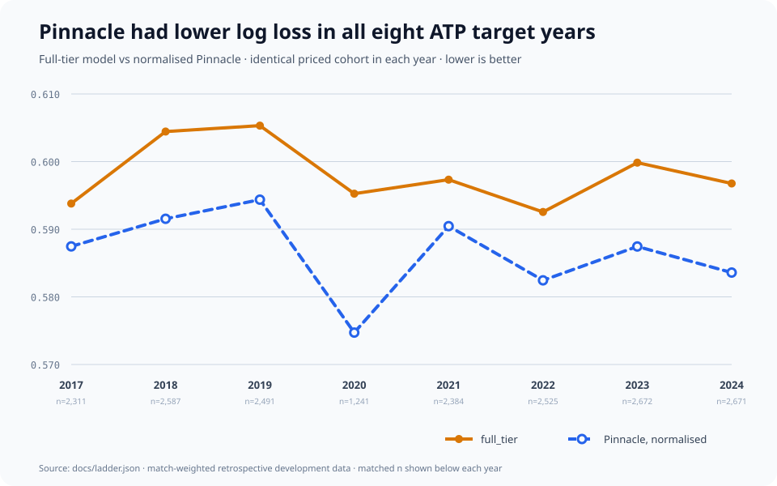

# tennis-lab

**How far can public tennis statistics take a pre-match forecast?** tennis-lab builds a
series of models: start with a simple player rating, add recent results and
serve/return history, then test whether information from lower-level tournaments helps.
Each model is evaluated on later matches than the ones used to train it, subject to the
historical data limitations explained below.

In historical tests on matches with both model forecasts and bookmaker odds, the
strongest accepted men's model picked **66.51%** of winners correctly and the women's
model picked **66.13%**. Adding more tennis history also improved the quality of the
probabilities, although the probabilities implied by Pinnacle's betting odds scored
better. The measures and comparison are explained below.

These historical matches have been examined during development. They are not an
untouched final test or a record of forecasts issued before real matches began.

## How often did the model pick the winner?

A forecast picks player A when its probability is above 50% and player B when it is below
50%. An exact 50% forecast is reported as a tie. The final ATP and WTA sports models had
no ties on these sets of matches, so accuracy here is simply correct picks divided by
matches tested.

### ATP — men's tour, full-tier model

| Year tested | Matches | Correct picks | Accuracy |
|---|---:|---:|---:|
| 2017 | 2,311 | 1,543 | 66.77% |
| 2018 | 2,587 | 1,708 | 66.02% |
| 2019 | 2,491 | 1,645 | 66.04% |
| 2020 | 1,241 | 835 | 67.28% |
| 2021 | 2,384 | 1,597 | 66.99% |
| 2022 | 2,525 | 1,694 | 67.09% |
| 2023 | 2,672 | 1,771 | 66.28% |
| 2024 | 2,671 | 1,766 | 66.12% |
| **Overall** | **18,882** | **12,559** | **66.51%** |

### WTA — women's tour, full model

| Year tested | Matches | Correct picks | Accuracy |
|---|---:|---:|---:|
| 2025 | 2,243 | 1,477 | 65.85% |
| 2026 partial sample | 101 | 73 | 72.28% |
| **Overall** | **2,344** | **1,550** | **66.13%** |

The 2026 row covers only 101 matches with available odds, from an incomplete sample
already examined during development. It does not represent a full season or a fresh
test. Accuracy uses saved forecasts and match results for the same matches as the
probability-score table below; no model was trained or chosen again to produce it.
[`docs/winner_accuracy.csv`](docs/winner_accuracy.csv) and
[`docs/winner_accuracy.json`](docs/winner_accuracy.json) report every ladder rung and the
market reference with `n`, correct picks, exact ties, and accuracy. For models with ties,
the generated reports preserve the full set of matches and give each tie half credit,
equivalent to choosing randomly when the model has no favourite.

Regenerate those aggregate-only files from a local copy of the research archive:

```sh
TENNISLAB_ARCHIVE=/path/to/tennis-research-lab-archive \
  uv run python tools/render_winner_accuracy.py
```

## What the model names mean

- **ATP** is the men's tour; **WTA** is the women's tour.
- **Elo** is a player-strength rating that changes after results. This version averages
  overall and surface-specific win probabilities.
- **base** combines past ratings, rankings, workload, match context, and available
  serve/return counts using a model that combines many small decision rules.
- **full** adds player traits and serve/return states that update match by match.
- **full tier** is ATP-only. It adds results from qualifying and lower-level professional
  tournaments (Challenger and Futures) to the full model.

Models for each year are trained and selected using earlier seasons. Because those
years share players and training histories, their results are not wholly independent
tests.

## Why log loss is still the main score

Accuracy only asks which side of 50% a forecast chose: 51% and 99% are the same winner
pick. Log loss also grades confidence, rewarding well-calibrated probabilities and
penalising confident mistakes. A model that says 50/50 for every match scores
`ln(2) ≈ 0.693`; lower is better.

**Pinnacle is a sports bookmaker.** Its odds provide a useful real-world comparison:
how do our tennis-statistics forecasts compare with probabilities implied by a betting
market? We convert each player's odds to a probability, then rescale the pair to add up
to 100%, removing the bookmaker's quoted margin. Our sports models do not use these
odds as predictors.

| Tour and target years | Matches | Elo | base | full | full tier | Pinnacle |
|---|---:|---:|---:|---:|---:|---:|
| ATP, 2017–2024 | 18,882 | 0.6237 | 0.6121 | 0.6053 | 0.5984 | 0.5873 |
| WTA, 2025–2026 | 2,344 | 0.6265 | 0.6230 | 0.6153 | — | 0.5953 |

Each match counts equally, and every column uses the same matches. The stored odds
do not have verified timestamps: they may reflect information that arrived after the
model's inputs were cut off. This makes the comparison informative, but it does not show
who would have predicted better using only information available at the same moment.



The full generated log-loss report is in [`docs/RESULTS.md`](docs/RESULTS.md), with
machine-readable values in [`docs/ladder.json`](docs/ladder.json).

## What is reproducible today

The public repository includes the full model-building and evaluation code,
configurations, aggregate results, and synthetic acceptance samples. It is not yet a
ready-to-use prediction app. A reviewed release candidate contains 40 accepted
year-specific boosted-tree checkpoints, their learned calibration slopes, and the Elo
state. Public download is pending the integrated release check; see
[`docs/MODEL_RELEASE.md`](docs/MODEL_RELEASE.md) for coverage and usage. Even with those weights, forecasting a
match from two player names still requires prepared history, ratings, rankings,
serve/return dynamics, and ATP lower-tier feature state that are not bundled today.

Exact historical reconstruction therefore still requires the separate research archive.
The manual workflow currently demonstrates Elo forecasts using made-up test data.
Connecting all six model configurations to verified real-history inputs is still pending. See
[`docs/ARCHIVE.md`](docs/ARCHIVE.md) and [`docs/live/README.md`](docs/live/README.md).

The reconstruction records which past results each model used, saves forecasts before
scoring them, checks that evidence files have not changed, and deliberately introduces
errors to test whether the safeguards catch them. These checks cover specific risks;
they do not prove that every historical input was available at the claimed time. [`docs/METHODS.md`](docs/METHODS.md),
[`docs/PROCESS.md`](docs/PROCESS.md), and [`docs/INTEGRITY.md`](docs/INTEGRITY.md) explain
the chronology, failures, repairs, and remaining limits.

## Current evidence status

- **Historical results:** reproduced independently within the documented scope.
- **Live forecasting record:** none yet. No real forecast batch has been published
  before play and later scored under a plan fixed in advance.
- **Data horizons:** ATP uses a 2005–2024 panel with 2017–2024 targets. WTA uses a
  2007–2026 panel with 2025–2026 targets; that short, exposed window includes known
  chronology limitations. [`docs/DATA.md`](docs/DATA.md) separates acquisition,
  qualification, and actual model use.
- **Hosted CI:** GitHub Actions run
  [`34912269136`](https://github.com/riddlejack/tennis-lab/actions/runs/34912269136)
  passed on exact commit `0c86652720455bc40c6c2de3681c69eeb3349d87`. A later commit
  should not be inferred green until its own run completes.

## Run the engineering harness

Python 3.14.6 is required by the locked environment.

```sh
make setup
make test
make reproduce-small
make reproduce-tier
```

The two reproduction samples invoked above are synthetic engineering checks; they do not
measure predictive performance on real tennis.

## Data and licence

Code is MIT-licensed. Historical match, ranking, and player data is credited to
[Jeff Sackmann / Tennis Abstract](https://github.com/JeffSackmann) under
[CC BY-NC-SA 4.0](https://creativecommons.org/licenses/by-nc-sa/4.0/). Other source and
redistribution boundaries are listed in [`DATA_LICENSES.md`](DATA_LICENSES.md).
